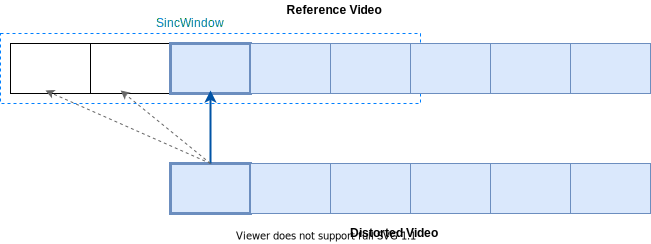
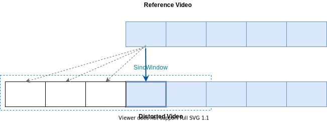

# easyVmaf

Python tool based on ffmpeg and ffprobe to deal with the video preprocesing required for VMAF inputs:
* Deinterlacing
* Upscaling/downscaling
* Frame-to-Frame Syncing
* Frame rate adaptation

Details about **How it Works** can be found [here](https://ottverse.com/vmaf-easyvmaf/).

## Updates

Since `easyVmaf` `2.0` only FFmpeg versions >= `5.0` will be supported. For using `easyVmaf` with FFmpeg < `5.0`, please consider rollingback to `easyVmaf` `1.3`.

New feaures and updates:

* [Cambi feature](https://github.com/Netflix/vmaf/blob/master/resource/doc/cambi.md#options) - Netflix banding detector, supported. 

* Command line ussage updated according to [libvmaf docs](https://ffmpeg.org/ffmpeg-filters.html#libvmaf)

* [Cambi heatmap](https://github.com/Netflix/vmaf/issues/936) support added.  The outputs may be visualized with [ffplay](https://github.com/Netflix/vmaf/issues/1016#issuecomment-1099591977)

* Built-in VMAF models are only supported since they are included in FFmpeg  >= `v5.0`. 

* Docker image - better handling of dependencies and built instruccions

* 'HD Neg' and 'HD phone' models are computed by default 

## Requirements

* `Linux`/`OSX`

* Python `>= v3.0`

* Python module [ffmpeg_progress_yield](https://github.com/slhck/ffmpeg-progress-yield)

* FFmpeg >= `5.0` build with `libvmaf`. More details [here](http://underpop.online.fr/f/ffmpeg/help/libvmaf.htm.gz)

## Installation

* Just clone the repo and run it from the source folder.

```bash
$ git clone https://github.com/gdavila/easyVmaf.git
$ cd easyVmaf
```

* Run from [docker image](https://hub.docker.com/repository/docker/gfdavila/easyvmaf). More info at the [end of this document](#Docker-Image-usage).

## Usage

```console
$ python3 easyVmaf.py
usage: easyVmaf [-h] -d D -r R [-sw SW] [-ss SS] [-fps FPS] [-subsample N] [-reverse] [-model MODEL]
                [-threads THREADS] [-verbose] [-progress] [-endsync] [-output_fmt OUTPUT_FMT]
                [-cambi_heatmap]

Script to easy compute VMAF using FFmpeg. It allows to deinterlace, scale and sync Ref and Distorted video samples automatically:                         

 	 Autodeinterlace: If the Reference or Distorted samples are interlaced, deinterlacing is applied                        

 	 Autoscale: Reference and Distorted samples are scaled automatically to 1920x1080 or 3840x2160 depending on the VMAF model to use                        

 	 Autosync: The first frames of the distorted video are used as reference to a sync look up with the Reference video.                         
 	 	 The sync is doing by a frame-by-frame look up of the best PSNR                        
 	 	 See [-reverse] for more options of syncing                        

 As output, a json file with VMAF score is created

optional arguments:
  -h, --help            show this help message and exit
  -sw SW                Sync Window: window size in seconds of a subsample of the Reference video. The sync lookup will be done between the first frames of the Distorted input and this Subsample of the Reference. (default=0. No sync).
  -ss SS                Sync Start Time. Time in seconds from the beginning of the Reference video to which the Sync Window will be applied from. (default=0).
  -fps FPS              Video Frame Rate: force frame rate conversion to <fps> value. Autodeinterlace is disabled when setting this
  -subsample N          Specifies the subsampling of frames to speed up calculation. (default=1, None).
  -reverse              If enable, it Changes the default Autosync behaviour: The first frames of the Reference video are used as reference to sync with the Distorted one. (Default = Disable).
  -model MODEL          Vmaf Model. Options: HD, 4K. (Default: HD).
  -threads THREADS      number of threads
  -verbose              Activate verbose loglevel. (Default: info).
  -progress             Activate progress indicator for vmaf computation. (Default: false).
  -endsync              Activate end sync. This ends the computation when the shortest video ends. (Default: false).
  -output_fmt OUTPUT_FMT
                        Output vmaf file format. Options: json or xml (Default: json)
  -cambi_heatmap        Activate cambi heatmap. (Default: false).
  -sync_only            Sync measurement only. No Vmaf processing (Default: false).

required arguments:
  -d D                  Distorted video
  -r R                  Reference video 
```

## Examples

### Syncing: Reference Video delayed in regard with the first frame of Distorted one.



VMAF computation for two video samples, `reference.ts` and `distorted-A.ts`. Both videos are not synced: `reference.ts` is delayed in comparition with `distorted-A.ts`, i.e.,  the first frame of `distorted-A.ts` matchs with the frame located at 0.7007 seconds since the begining of `reference.ts` (blue arrow on the figure). To sync both videos automatically using `easyVmaf`, the next command line is used:

    ```bash
    $ python3 easyVmaf.py -d distorted-A.ts -r reference.ts -sw 2


    ...
    ...
    [Ignored outputs]
    ...
    ...

    Sync Info:
    offset:  0.7007000000000001 psnr:  48.863779
    VMAF score:  89.37913542219542
    VMAF json File Path:  distorted-A_vmaf.json
    ```

The previus command line takes a synchronisation window `sw` of *2 seconds* , this means that the sync lookup will be done between the first frame of `distorted-A.ts` (actually, in practise it takes into account several frames) and a subsample of `reference.ts` of *2 seconds* lenght since its begin.

    ```bash
    $ python3 easyVmaf.py -d distorted.ts -r reference.ts -sw 2
    ...
    ...
    [Ignored FFmpeg outputs]
    ...
    ...
    Sync Info:
    offset:  0.7007000000000001 psnr:  48.863779
    VMAF score:  89.37913542219542
    VMAF json File Path:  distorted.json
    ```

### Syncing: Distorted Video delayed in regard with the first frame of Reference one.


This time,  `distorted-B.ts` is delayed in comparition with `reference.ts`, i.e.,  The first frame of `reference.ts` matchs with the frame located at 8.3003 seconds since the begining of `distorted-B.ts`. To sync the videos automatically, the next command line is used:

    ```bash
    $ python3 easyVmaf.py -d distorted-B.ts -r reference.ts -sw 3 -ss 6 -reverse


    ...
    ...
    [Ignored FFmpeg outputs]
    ...
    ...

    Sync Info:
    offset:  8.300300000000000 psnr:  34.897866
    VMAF score:  92.34452778643345
    VMAF json File Path:  distorted-B_vmaf.json
    ```

 The previous command line applies a syncronization window `sw` of *3 seconds*,  a *sync start time* `ss` *of 6 seconds* and the `reverse` flag.  
 
Note the use of the  `reverse`  flag (that was not used on the first example). This flag allows to interchange to which video the `syncWindow` will be applied (reference or distorted).


## Docker Image usage

A [docker image](https://hub.docker.com/repository/docker/gfdavila/easyvmaf) is available on docker hub to run easyVmaf in a straightforward way.

The Docker Image is basically an ubuntu image with `ffmpeg` and `libvmaf` already installed. You can check the [Dockerfile](https://hub.docker.com/r/gfdavila/easyvmaf/dockerfile) for more details.

The easiest way to run easyVmaf through Docker is mounting a shared volume between your host machine and the container. This volume should have inside it all the video files you want to analyze. The outputs (vmaf information files) will be putting in this shared folder also.

Example

```bash
docker run --rm -v <local-path-to-your-video-files>:/<custom-name-folder> gfdavila/easyvmaf -r /<custom-name-folder>/video-1.mp4 -d /<custom-name-folder>/video-2.mp4
```

Some video samples located on the docker image:

```bash
NAME                        TIME

                           t=0
                            |
BBB_reference_10s.mp4       */-----------------------------*/
BBB_sampleA_distorted.mp4           */---------------------*/
BBB_sampleB_distorted.mp4       */-------------------------*/

```

Run docker container to get VMAF between `BBB_reference_10s.mp4` and `BBB_sampleA_distorted.mp4`:

```bash
:~$ docker run --rm  gfdavila/easyvmaf -r video_samples/BBB_reference_10s.mp4 -d video_samples/BBB_sampleA_distorted.mp4 -sw 1 -ss 1
```

Run docker container to get VMAF between `BBB_sampleA_distorted.mp4` and `BBB_sampleB_distorted.mp4`:

```bash
:~$ docker run --rm  gfdavila/easyvmaf -r video_samples/BBB_sampleA_distorted.mp4 -d video_samples/BBB_sampleB_distorted.mp4 -sw 2 -ss 0 -reverse
```
