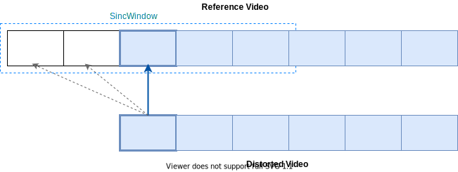
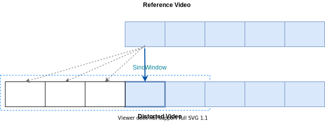

# easyVmaf

Python tool based on FFmpeg and FFprobe to handle the video preprocessing required for VMAF:

- Deinterlacing
- Upscaling / downscaling
- Frame-to-frame syncing
- Frame rate adaptation

Details about **How it Works** can be found [here](https://ottverse.com/vmaf-easyvmaf/).

## Requirements

- Linux / macOS
- Python >= 3.8
- FFmpeg >= 5.0 built with `--enable-libvmaf` (built-in models required)
- Python package: [`ffmpeg-progress-yield`](https://github.com/slhck/ffmpeg-progress-yield)

For GPU-accelerated VMAF:

- NVIDIA GPU with CUDA support
- FFmpeg built with `--enable-nonfree --enable-ffnvcodec --enable-libvmaf`
- libvmaf built with `-Denable_cuda=true -Denable_float=true`
- [NVIDIA Container Toolkit](https://docs.nvidia.com/datacenter/cloud-native/container-toolkit/latest/install-guide.html) (for Docker GPU usage)

## Installation

```bash
pip install easyvmaf
```

Or from source:

```bash
git clone https://github.com/gdavila/easyVmaf.git
cd easyVmaf
pip install -e .
```

FFmpeg must be on `PATH`, or override via environment variables:

```bash
FFMPEG=/path/to/ffmpeg FFPROBE=/path/to/ffprobe easyvmaf ...
```

## Usage

```
easyvmaf -d <distorted> -r <reference> [options]
```

### Required arguments

| Flag | Description |
|------|-------------|
| `-d D` | Distorted video path (supports glob patterns for batch) |
| `-r R` | Reference video path |

### Optional arguments

| Flag | Default | Description |
|------|---------|-------------|
| `-sw SW` | `0` | Sync window size in seconds. Enables automatic sync search between the first frames of the distorted and a subsample of the reference. `0` disables sync. |
| `-ss SS` | `0` | Sync start time: offset into the reference where the sync window begins. |
| `-fps FPS` | `0` | Force frame rate conversion. Disables auto-deinterlace when set. |
| `-subsample N` | `1` | Frame subsampling factor to speed up computation. |
| `-reverse` | off | Reverse sync direction: match reference first-frames against distorted instead of the default. |
| `-model MODEL` | `HD` | VMAF model. Options: `HD`, `4K`. |
| `-threads N` | `0` | Number of threads (0 = auto). |
| `-output_fmt FMT` | `json` | Per-frame VMAF output file format: `json`, `xml`, or `csv`. |
| `-verbose` | off | Enable verbose log level. |
| `-progress` | off | Show FFmpeg progress during VMAF computation. |
| `-endsync` | off | Stop when the shorter video ends. |
| `-cambi_heatmap` | off | Compute and save CAMBI banding heatmap. |
| `-sync_only` | off | Measure sync offset only — skip VMAF computation. |
| `-json` | off | Print final results as JSON to stdout. Compatible with `-sync_only` and full VMAF runs. In batch mode, one JSON object per line (NDJSON). |
| `-gpu` | off | Use GPU-accelerated VMAF via `libvmaf_cuda`. Requires a CUDA-capable FFmpeg build (see [Docker: CUDA](#cuda-gpu-build)). |

## Examples

### Basic VMAF (no sync)

```bash
easyvmaf -d distorted.mp4 -r reference.mp4
```

### With automatic sync

```bash
# Sync window of 2 seconds starting from the beginning of reference
easyvmaf -d distorted.mp4 -r reference.mp4 -sw 2

# Sync window starting at 6 s into reference, reverse direction
easyvmaf -d distorted.mp4 -r reference.mp4 -sw 3 -ss 6 -reverse
```

### Sync measurement only

```bash
# Human-readable output
easyvmaf -d distorted.mp4 -r reference.mp4 -sw 2 -sync_only

# Structured JSON output
easyvmaf -d distorted.mp4 -r reference.mp4 -sw 2 -sync_only -json
```

### Structured JSON output

The `-json` flag prints a single JSON object to stdout (or one object per line in batch mode):

```bash
easyvmaf -d distorted.mp4 -r reference.mp4 -sw 2 -json
```

```json
{
  "distorted": "distorted.mp4",
  "reference": "reference.mp4",
  "sync": { "offset": 0.7007, "psnr": 48.863779 },
  "vmaf": {
    "model": "HD",
    "vmaf_hd": 89.123456,
    "vmaf_hd_neg": 88.654321,
    "vmaf_hd_phone": 91.234567,
    "output_file": "distorted_vmaf.json"
  }
}
```

### Batch processing

```bash
# Glob pattern — one result per file
easyvmaf -d "folder/*.mp4" -r reference.mp4 -json
```

### 4K model

```bash
easyvmaf -d distorted_4k.mp4 -r reference_4k.mp4 -model 4K
```

### GPU-accelerated VMAF

Requires a CUDA build of FFmpeg/libvmaf (see Docker section below):

```bash
easyvmaf -d distorted.mp4 -r reference.mp4 -gpu
```

Sync computation always runs on CPU regardless of `-gpu`. The GPU is used only for the final VMAF scoring step.

---

## Docker

### CPU build

```bash
docker build -t easyvmaf .
```

### CUDA / GPU build

```bash
docker build -f Dockerfile.cuda -t easyvmaf:cuda .
```

> **Note:** The CUDA image links FFmpeg with `--enable-nonfree` components (nvcc/CUDA). It cannot be legally redistributed — build and use locally only.

### Build arguments

Both Dockerfiles accept these build-time arguments:

| ARG | Default | Description |
|-----|---------|-------------|
| `FFMPEG_version` | `8.1` | FFmpeg release tag |
| `VMAF_version` | `3.0.0` | libvmaf release tag |
| `EASYVMAF_VERSION` | `2.1.0` | easyVmaf version label |
| `DAV1D_version` | `1.4.3` | dav1d release (CUDA image only — built from source) |

```bash
# Custom versions
docker build --build-arg FFMPEG_version=8.1 --build-arg VMAF_version=3.0.0 -t easyvmaf .
```

### Running with Docker

```bash
# CPU
docker run --rm -v /path/to/videos:/videos \
  easyvmaf -d /videos/distorted.mp4 -r /videos/reference.mp4

# With sync
docker run --rm -v /path/to/videos:/videos \
  easyvmaf -d /videos/distorted.mp4 -r /videos/reference.mp4 -sw 2

# JSON output
docker run --rm -v /path/to/videos:/videos \
  easyvmaf -d /videos/distorted.mp4 -r /videos/reference.mp4 -json

# GPU (requires NVIDIA Container Toolkit)
docker run --rm --gpus all -v /path/to/videos:/videos \
  easyvmaf:cuda -d /videos/distorted.mp4 -r /videos/reference.mp4 -gpu
```

### Docker Compose

A `docker-compose.yml` is included with pre-configured `easyvmaf` (CPU) and `easyvmaf-cuda` (GPU) services:

```bash
# CPU service
VIDEO_DIR=/path/to/videos docker compose run easyvmaf \
  -d /videos/distorted.mp4 -r /videos/reference.mp4

# GPU service
VIDEO_DIR=/path/to/videos docker compose run easyvmaf-cuda \
  -d /videos/distorted.mp4 -r /videos/reference.mp4 -gpu
```

`VIDEO_DIR` defaults to `./video_samples` if not set.

---

## Sync examples explained

### Reference delayed relative to distorted



`reference.ts` starts 0.7 seconds after `distorted-A.ts`. Use `-sw` to search for the offset automatically:

```bash
easyvmaf -d distorted-A.ts -r reference.ts -sw 2
```

The sync window `sw=2` means easyVmaf searches the first 2 seconds of `reference.ts` for the best PSNR match against the first frames of `distorted-A.ts`.

### Distorted delayed relative to reference



`distorted-B.ts` starts 8.3 seconds after `reference.ts`. Use `-reverse` to flip the sync direction:

```bash
easyvmaf -d distorted-B.ts -r reference.ts -sw 3 -ss 6 -reverse
```

`-ss 6` begins the sync search 6 seconds into `reference.ts`; `-reverse` matches reference first-frames against the distorted stream.
