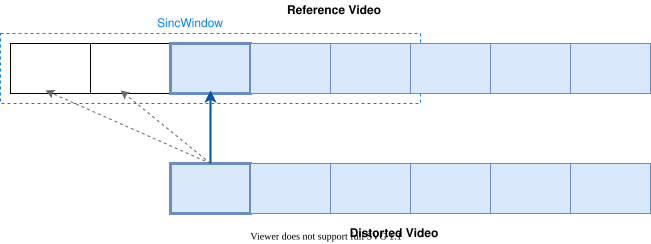
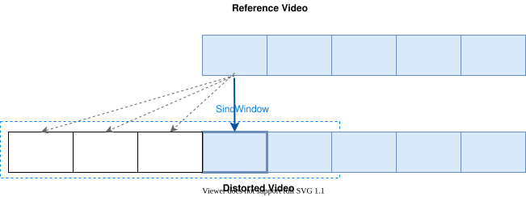

# easyVmaf

Python tool based on FFmpeg and FFprobe to handle the video preprocessing required for VMAF:

- Deinterlacing
- Upscaling / downscaling
- Frame-to-frame syncing
- Frame rate adaptation
- Pixel format normalization

Since 4.0, easyVmaf computes [VMAF v1](https://github.com/Netflix/vmaf/blob/master/resource/doc/models_v1.md)
by default. The VMAF v0.6 models of easyVmaf 3.x are still available with
`--vmaf-version 0.6`. Upgrading from 3.x? See [Migrating from 3.x](#migrating-from-3x).

Details about **How it Works** can be found [here](https://ottverse.com/vmaf-easyvmaf/).

## Requirements

- Linux / macOS
- Python >= 3.8
- FFmpeg >= 8.1 built with `--enable-libvmaf`
- libvmaf >= 3.2.1 built with `-Dbuilt_in_models=true`
- Python package: [`ffmpeg-progress-yield`](https://github.com/slhck/ffmpeg-progress-yield)

easyVmaf checks both at startup. It exits with an error if FFmpeg is older than
8.1, or if its libvmaf cannot compute a frame with the VMAF v1 model
`vmaf_v1.0.16_3d0h`.

### Why libvmaf 3.2.1

The VMAF v1 models ship with [libvmaf 3.2.0](https://github.com/Netflix/vmaf/releases/tag/v3.2.0),
but 3.2.0 is not enough:

- In 3.2.0 the `speed_chroma` feature extractor, used by every v1 model, is only
  compiled with `-Denable_float=true`, which is off by default. A default 3.2.0
  build loads the v1 models but fails to compute them
  (`problem during vmaf_use_features_from_model`). Fixed in
  [3.2.1](https://github.com/Netflix/vmaf/releases/tag/v3.2.1) by [PR #1558](https://github.com/Netflix/vmaf/pull/1558).
- 3.2.0 can grow memory without bound when decoding is faster than feature
  extraction ([issue #1587](https://github.com/Netflix/vmaf/issues/1587)). v1 is
  slower to extract than v0.6, so the risk is higher. Fixed in 3.2.1.
- 3.2.1 also fixes wrong CUDA scores with inputs above 8 bits, which matters for
  `--gpu`.

libvmaf 3.2.1 still reports itself as **3.2.0**: `pkg-config --modversion libvmaf`
and the `version` field of the libvmaf log both say `3.2.0`, because the upstream
`v3.2.1` tag kept that version string. No version check can tell the two apart.
The only reliable test is to compute a frame with a v1 model, which is what
easyVmaf does at startup (see [Verifying your build](#verifying-your-build)).

### Getting a valid build

**Docker (recommended).** The project images build FFmpeg 8.1 with libvmaf
3.2.1 and its built-in models. See [Docker](#docker).

**macOS (Homebrew).** Homebrew ships libvmaf 3.2.1:

```bash
brew update
brew upgrade libvmaf ffmpeg
```

**From source.** Build libvmaf 3.2.1 with meson, then build FFmpeg >= 8.1 against it:

```bash
curl -LO https://github.com/Netflix/vmaf/archive/v3.2.1.tar.gz
tar -xzf v3.2.1.tar.gz
cd vmaf-3.2.1/libvmaf
meson setup build --buildtype release -Dbuilt_in_models=true
ninja -C build
sudo ninja -C build install

# then, in the FFmpeg >= 8.1 source tree
./configure --enable-libvmaf --enable-version3 && make && sudo make install
```

`-Denable_float=true` is not needed with 3.2.1.

### Verifying your build

This command computes one frame with a VMAF v1 model. It is the same probe
easyVmaf runs at startup:

```bash
ffmpeg -hide_banner -loglevel error \
  -f lavfi -i color=black:s=320x240:r=1:d=1 \
  -f lavfi -i color=black:s=320x240:r=1:d=1 \
  -lavfi libvmaf=model=version=vmaf_v1.0.16_3d0h:log_fmt=json:log_path=/dev/null \
  -f null -
```

The build is valid when the command exits with code 0 and prints nothing. The
probe frames are 320x240 because the SpEED feature of v1 rejects frames smaller
than about 288x162. That limit does not affect normal use: easyVmaf always scales
the inputs to 1920x1080 or 3840x2160 before libvmaf.

### GPU requirements

For GPU-accelerated VMAF (`--gpu`, VMAF v0.6 only, see [GPU](#gpu)):

- NVIDIA GPU with CUDA support
- FFmpeg built with `--enable-nonfree --enable-ffnvcodec --enable-libvmaf`
- libvmaf built with `-Denable_cuda=true`
- [NVIDIA Container Toolkit](https://docs.nvidia.com/datacenter/cloud-native/container-toolkit/latest/install-guide.html) (for Docker GPU usage)

## Installation

```bash
pip install easyvmaf
```

Or from source:

```bash
git clone https://github.com/gdavila/easyVmaf.git
cd easyVmaf
pip install -e .
```

FFmpeg must be on `PATH`, or override via environment variables:

```bash
FFMPEG=/path/to/ffmpeg FFPROBE=/path/to/ffprobe easyvmaf ...
```

## Usage

```
easyvmaf -d <distorted> -r <reference> [options]
```

`easyvmaf --help` groups the options in the same sections as the tables below.

### Input

| Flag | Default | Description |
|------|---------|-------------|
| `-d`, `--distorted` | required | Distorted video path. Accepts a glob pattern for batch processing. |
| `-r`, `--reference` | required | Reference video path. |
| `--fps FPS` | `0` | Force frame rate conversion. Disables auto-deinterlace when set. |

### Synchronization

| Flag | Default | Description |
|------|---------|-------------|
| `--sync-window SW` | `0` | Sync window size in seconds. Enables automatic sync search between the first frames of the distorted video and a subsample of the reference. `0` disables sync. |
| `--sync-start SS` | `0` | Sync start time: offset into the reference where the sync window begins. |
| `--sync-only` | off | Measure the sync offset for every input and skip VMAF. Requires an explicit, finite `--sync-window` greater than zero. |
| `--reverse` | off | Reverse sync direction: match the first frames of the reference against the distorted video. |
| `--end-sync` | off | Stop when the shorter video ends. |

### Models

| Flag | Default | Description |
|------|---------|-------------|
| `--display {hd,4k}` | `hd` | Target display. Inputs are scaled to 1920x1080 (`hd`) or 3840x2160 (`4k`). |
| `--vmaf-version {1,0.6} [...]` | `1` | VMAF generations to compute. `--vmaf-version 1 0.6` computes both in one pass. |
| `--bitdepth {auto,8,10}` | `auto` | Measurement bit depth. `auto`: 10 with any v1 model, otherwise the reference bit depth. See [Pixel format](#pixel-format). |

### VMAF v1 parameters

These flags apply only to VMAF v1 models. Using them without `1` in
`--vmaf-version` is an error, except `--hfr auto` and `--hfr off`.

| Flag | Default | Description |
|------|---------|-------------|
| `--view {3h,5h,phone,1.5h} [...]` | hd: `3h 5h`; 4k: `1.5h` | Viewing distances, in picture heights. `phone` is an alias of `5h`. With `--display 4k`, `3h` selects the [0, 110] model. |
| `--hfr {auto,on,off}` | `auto` | High frame rate models. `auto`: when the effective frame rate is >= 47 fps. See [High frame rate](#high-frame-rate). |
| `--enc-size WxH` | distorted video size | Encoding resolution passed to CAMBI. |
| `--enc-bitdepth {8,10,12}` | from the distorted `pix_fmt` | Encoding bit depth passed to CAMBI. |
| `--model-option FEATURE.OPTION=VALUE` | — | Advanced override of a v1 model option, e.g. `cambi.topk=0.5`. Repeatable. |

### Output

| Flag | Default | Description |
|------|---------|-------------|
| `--output-format {json,xml,csv}` | `json` | Format of the per-frame libvmaf log. |
| `--json` | off | Print the final results as JSON to stdout. Compatible with `--sync-only` and full VMAF runs. In batch mode, one JSON object per line (NDJSON). |
| `--cambi-heatmap` | off | Compute and save CAMBI banding heatmaps. |
| `--verbose` | off | Enable verbose log level. |
| `--progress` | off | Show FFmpeg progress during the VMAF computation. |

### Execution

| Flag | Default | Description |
|------|---------|-------------|
| `--threads N` | `0` | Parallel single-threaded sync workers and libvmaf threads (0 = CPU count). |
| `--subsample N` | `1` | Frame subsampling factor to speed up the computation. |
| `--gpu` | off | GPU-accelerated VMAF via `libvmaf_cuda`. Only supports `--vmaf-version 0.6`. Requires a CUDA build of FFmpeg (see [Docker: CUDA](#cuda--gpu-build)). |

### Validation

Invalid arguments are usage errors (exit code 2), reported on stderr before
checking FFmpeg or probing videos. They are never converted to valid values or
replaced with defaults.

- `--sync-window`, `--sync-start` and `--fps` accept finite numbers greater than
  or equal to zero. Zero keeps the defaults: no sync search, no start offset, and
  automatic frame rate handling.
- `--subsample` accepts integers of at least 1; `--threads` accepts integers of
  at least 0.
- `--display`, `--view`, `--hfr` and `--bitdepth` are case-insensitive
  (`--display 4K` works). `--output-format` is case-sensitive.
- `--view`, `--hfr on`, `--enc-size`, `--enc-bitdepth` and `--model-option`
  require a VMAF v1 model in `--vmaf-version`.
- A view that does not exist for the display is an error, e.g. `--view 5h`
  with `--display 4k`.
- `--gpu` requires `--vmaf-version 0.6` alone, and cannot be combined with
  `--bitdepth 10`.
- `--model-option` must match `feature.option=value`, with lowercase names and a
  value made of letters, digits, `_`, `.` and `-`. Nothing else can reach the
  FFmpeg filter graph.
- easyVmaf 3.x flags are rejected with their 4.0 name, e.g.
  `error: -sw was removed in easyVmaf 4.0, use --sync-window`.

## Models

| Score name | libvmaf model | Version | Display | View | Range | Default |
|---|---|---|---|---|---|---|
| `vmaf_v1_hd` | `vmaf_v1.0.16_3d0h` | 1 | hd | 3h | [0, 100] | yes |
| `vmaf_v1_phone` | `vmaf_v1.0.16_5d0h` | 1 | hd | 5h | [0, 100] | yes |
| `vmaf_v1_4k` | `vmaf_v1.0.16_1d5h_2160` | 1 | 4k | 1.5h | [0, 100] | yes |
| `vmaf_v1_4k_3h` | `vmaf_v1.0.16_3d0h_2160` | 1 | 4k | 3h | [0, 110] | no (`--view 3h`) |
| `vmaf_hd` | `vmaf_v0.6.1` | 0.6 | hd | — | [0, 100] | yes |
| `vmaf_hd_neg` | `vmaf_v0.6.1neg` | 0.6 | hd | — | [0, 100] | yes |
| `vmaf_hd_phone` | `vmaf_v0.6.1` + `enable_transform=true` | 0.6 | hd | — | [0, 100] | yes |
| `vmaf_4k` | `vmaf_4k_v0.6.1` | 0.6 | 4k | — | [0, 100] | yes |

All models are libvmaf built-in models. Each v1 model also has a high frame rate
variant with `_hfr_` in its id (e.g. `vmaf_v1.0.16_hfr_3d0h`). The HFR variant
keeps the score name; only `libvmaf_model` changes.

VMAF v1 differs from v0.6 in ways that change the scores:

- v1 uses the `cambi`, `speed_chroma_uv`, `adm3` and `motion3` features. VIF is
  gone. v1 measures chroma and banding; v0.6 measures luma only.
- The v1 phone model is a separate 5H model, not the score transform of v0.6.
  The v1 models already enable their own score transform.
- The 4K model at 3H (`vmaf_v1_4k_3h`) ranges from 0 to 110.

> **v1 and v0.6 scores are not comparable.** A v1 score of 85 is not a v0.6 score
> of 85. That is why every v1 score name starts with `vmaf_v1_` and never reuses
> `vmaf_hd` or `vmaf_4k`. To recalibrate quality thresholds, compute both
> generations in one pass with `--vmaf-version 1 0.6`.

## Automatic VMAF v1 parameters

easyVmaf resolves the v1 parameters from the stream information it already
probes, and from the effective frame rate after deinterlacing or `--fps`.

| Parameter | Automatic value | Override |
|---|---|---|
| Measurement pixel format | Chroma subsampling of the reference; 10 bits with any v1 model | `--bitdepth` |
| CAMBI encoding resolution | Width and height of the distorted video | `--enc-size WxH` |
| CAMBI encoding bit depth | From the distorted `pix_fmt` (`yuv420p` → 8, `yuv420p10le` → 10; no digits → 8) | `--enc-bitdepth` |
| HFR models | Effective frame rate >= 47 fps | `--hfr on/off` |
| Other model options | — | `--model-option` |

### Pixel format

libvmaf needs the same pixel format on both inputs. Without an explicit format,
FFmpeg picks one and may convert the reference down, for example from 4:2:2 to
4:2:0, or from 10 to 8 bits. v1 measures chroma, so that conversion would erase
exactly the chroma loss v1 is meant to measure.

easyVmaf measures both inputs in one format:

- Chroma subsampling: the reference's (4:2:0, 4:2:2 or 4:4:4). An unrecognized
  reference format is measured as 4:2:0, with a warning in the log.
- Bit depth: 10 when any v1 model is computed (or the reference bit depth, if
  higher); the reference bit depth with only v0.6 models; or `--bitdepth`.
  Netflix recommends measuring v1 at 10 bits for SDR content, even when the
  encode is 8 bits, to capture banding.

Each input whose native format differs gets a `format=` filter as the first
filter of its chain, before scaling and deinterlacing. For example, a `yuv422p`
reference with v1 is measured in `yuv422p10le`; a `yuv420p` reference with only
v0.6 is measured in `yuv420p`, with no filter if the distorted video is already
`yuv420p`. The format used is reported as `pix_fmt` in the results. Netflix does
not document whether the v1 models are calibrated for 4:2:2 or 4:4:4, so
`pix_fmt` lets you identify those measurements later.

### CAMBI encoding resolution

easyVmaf always scales the distorted video to the display resolution. Without
the encoding resolution, CAMBI would measure banding on the scaled picture.
easyVmaf passes the distorted video size and bit depth as `cambi.enc_width`,
`cambi.enc_height` and `cambi.enc_bitdepth` to every v1 model.

libvmaf 3.2.1 CAMBI rejects encoding sizes below 180x150, or with both sides
below 216, and the whole v1 calculation fails. Low ABR rungs such as 256x144,
192x108 or 160x90 fall below that limit. easyVmaf raises the size to the smallest
accepted one with the same aspect ratio and logs a warning:

```
CAMBI does not accept a 256x144 encoding size; using 267x150, the smallest accepted size with the same aspect ratio
```

The same adjustment applies to `--enc-size`.

### High frame rate

The HFR variants of the v1 models use a five-frame motion window and are
calibrated for ~50/60 fps. With `--hfr auto`, easyVmaf uses them when the
effective frame rate of the distorted video is at least 47 fps. The effective
frame rate is the distorted frame rate after deinterlacing and `--fps`, not the
container value. Above 60 fps, easyVmaf still uses the HFR
variants and logs a warning, since that is outside their calibration.

## Examples

### Basic VMAF (no sync)

```bash
# VMAF v1 HD: vmaf_v1_hd and vmaf_v1_phone
easyvmaf -d distorted.mp4 -r reference.mp4
```

### Model selection

```bash
# VMAF v1 4K at 1.5H
easyvmaf -d distorted.mp4 -r reference.mp4 --display 4k

# Both v1 4K models, 1.5H and 3H ([0, 110])
easyvmaf -d distorted.mp4 -r reference.mp4 --display 4k --view 1.5h 3h

# Only the v1 phone model
easyvmaf -d distorted.mp4 -r reference.mp4 --view phone

# VMAF v0.6 models, as in easyVmaf 3.x: vmaf_hd, vmaf_hd_neg, vmaf_hd_phone
easyvmaf -d distorted.mp4 -r reference.mp4 --vmaf-version 0.6

# v1 and v0.6 in one pass, to compare both generations
easyvmaf -d distorted.mp4 -r reference.mp4 --vmaf-version 1 0.6 --json
```

### CAMBI encoding parameters

```bash
# The distorted file was upscaled from a 1280x720 8-bit encode
easyvmaf -d distorted.mp4 -r reference.mp4 --enc-size 1280x720 --enc-bitdepth 8

# CAMBI heatmaps, written to <distorted>_cambi_heatmap/
easyvmaf -d distorted.mp4 -r reference.mp4 --cambi-heatmap
```

With v1 models the heatmap directory is passed inside the libvmaf `model=`
option, where `:`, `|`, `\` and `'` cannot be escaped. If the distorted file path
contains any of them, easyVmaf stops with an error before running FFmpeg; rename
or move the file.

### With automatic sync

```bash
# Sync window of 2 seconds starting from the beginning of reference
easyvmaf -d distorted.mp4 -r reference.mp4 --sync-window 2

# Sync window starting at 6 s into reference, reverse direction
easyvmaf -d distorted.mp4 -r reference.mp4 --sync-window 3 --sync-start 6 --reverse
```

Human-readable output of the first command (logs go to stderr):

```
=======================================
Results: distorted.mp4
=======================================
VMAF computed
=======================================
offset:  1.5  | psnr:  40.032121
pix_fmt: yuv420p10le | HFR: off
vmaf_v1_hd     93.256258  [vmaf_v1.0.16_3d0h, 0-100]
vmaf_v1_phone  95.393178  [vmaf_v1.0.16_5d0h, 0-100]
VMAF output file path:  distorted_vmaf.json
```

With `--sync-window 0` (the default), `--sync-start X` applies a manual offset:
positive to trim the reference, or negative with `--reverse` to trim the
distorted video. Both manual and automatic offsets use this sign convention in
JSON and human output. A zero manual offset is reported as `0.0`, including with
`--reverse`.

### Sync measurement only

`--sync-only` requires an explicit, finite `--sync-window` greater than zero.
Missing, zero, negative, NaN, or infinite windows are usage errors (exit code 2),
reported before checking FFmpeg or probing videos. Every matched input is
synchronized, with one result per file. JSON results contain only
`schema_version`, `distorted`, `reference`, and `sync`; no VMAF calculation or
output file is produced.

```bash
# Human-readable output
easyvmaf -d distorted.mp4 -r reference.mp4 --sync-window 2 --sync-only

# Structured JSON output
easyvmaf -d distorted.mp4 -r reference.mp4 --sync-window 2 --sync-only --json

# Batch: one JSON object per matched file (NDJSON)
easyvmaf -d "folder/*.mp4" -r reference.mp4 --sync-window 2 --sync-only --json
```

### Batch processing

```bash
# Glob pattern — one result per file
easyvmaf -d "folder/*.mp4" -r reference.mp4 --json
```

### GPU

```bash
easyvmaf -d distorted.mp4 -r reference.mp4 --vmaf-version 0.6 --gpu
```

`--gpu` only supports the v0.6 models: libvmaf 3.2.1 has no CUDA extractors for
the v1 features (`cambi`, `speed_chroma`, `adm3`, `motion3`). `--gpu` with any
v1 model, including the default, is a usage error:

```
error: --gpu only supports --vmaf-version 0.6: libvmaf_cuda cannot compute VMAF v1 models
```

In GPU mode both inputs are measured in `yuv420p`. Sync always runs on CPU; the
GPU is used only for the final VMAF scoring step.

## JSON output

`--json` prints one JSON object per file to stdout (NDJSON in batch mode), with
`schema_version: 2`:

```bash
easyvmaf -d distorted.mp4 -r reference.mp4 --sync-window 2 --json
```

```json
{
  "schema_version": 2,
  "distorted": "distorted.mp4",
  "reference": "reference.mp4",
  "sync": {"offset": 1.5, "psnr": 40.032121},
  "vmaf": {
    "display": "hd",
    "pix_fmt": "yuv420p10le",
    "hfr": false,
    "scores": {"vmaf_v1_hd": 93.256258, "vmaf_v1_phone": 95.393178},
    "models": [
      {"name": "vmaf_v1_hd", "libvmaf_model": "vmaf_v1.0.16_3d0h",
       "vmaf_version": "1", "view": "3h", "range": [0, 100]},
      {"name": "vmaf_v1_phone", "libvmaf_model": "vmaf_v1.0.16_5d0h",
       "vmaf_version": "1", "view": "5h", "range": [0, 100]}
    ],
    "output_file": "distorted_vmaf.json"
  }
}
```

| Field | Description |
|---|---|
| `schema_version` | `2` since easyVmaf 4.0. Present in every record, including `--sync-only`. |
| `sync.offset` | Offset in seconds. Positive: the reference was trimmed; negative: the distorted video was trimmed. |
| `sync.psnr` | Sync PSNR, or `null` when sync was not calculated or is not finite. |
| `vmaf.display` | `hd` or `4k`. |
| `vmaf.pix_fmt` | Pixel format both inputs were measured in. |
| `vmaf.hfr` | `true` when the v1 HFR variants were used. |
| `vmaf.scores` | Mean score of each model over all frames, keyed by score name. |
| `vmaf.models` | One entry per score: libvmaf model id (the `_hfr_` variant when HFR is on), VMAF version, view (`default`, `neg` or `phone` for v0.6) and score range. |
| `vmaf.output_file` | Per-frame libvmaf log: same directory and base name as the distorted video, plus `_vmaf.{json,xml,csv}`. |
| `vmaf.cambi_heatmap_path` | Heatmap directory, only with `--cambi-heatmap`. |

`vmaf.scores` is the flat view for quick reads; `vmaf.models` carries the context
needed to avoid comparing scores of different generations.

Each result is strict JSON. Logs, progress, diagnostics, and help associated with
usage errors go to stderr. Explicit `-h` help goes to stdout. If a file fails,
the command stops with a nonzero exit code and emits no result for that file;
successful records from earlier files in a batch remain on stdout.

SIGINT (Ctrl-C) exits with code 130 and reports the interruption on stderr.
The interrupted calculation emits no result; completed batch records remain on
stdout. An active VMAF scoring process is stopped and reaped, with a bounded wait.
During automatic synchronization, shutdown can still wait for running PSNR search
workers to finish.

Finite sync PSNR values keep their numeric value, rounded to six decimal places.
When sync PSNR was not calculated, `sync.psnr` is `null` with no status field.
For nonfinite PSNR, `sync.psnr` is also `null`, and `sync.psnr_status` identifies
the value as `"positive_infinity"`, `"negative_infinity"`, or `"nan"`. Identical
frames legitimately produce positive infinity. This representation affects only
JSON output; the Python API and sync calculation retain the numeric value.
Nonfinite offsets or VMAF scores cause an error before the result is emitted.

## Python API

```python
from easyvmaf import vmaf

v = vmaf('distorted.mp4', 'reference.mp4', display='hd', vmaf_versions=('1', '0.6'))
offset, psnr = v.syncOffset(2)     # optional: sync window of 2 s
result = v.getVmaf()               # VmafResult

result.scores    # {'vmaf_v1_hd': ..., 'vmaf_v1_phone': ..., 'vmaf_hd': ..., ...}
result.pix_fmt   # 'yuv420p10le'
result.log_path  # 'distorted_vmaf.json'
```

The package also exports `VmafResult`, `ModelSpec`, `CATALOG`, `select_models`,
`validate_model_config`, `UnsupportedModelConfigError` and
`UnsupportedFramerateError`. All `vmaf()` arguments after the two paths are
keyword-only: `display`, `vmaf_versions`, `views`, `hfr`, `bitdepth`,
`enc_size`, `enc_bitdepth`, `model_options`, `output_fmt`, `loglevel`,
`subsample`, `threads`, `print_progress`, `end_sync`, `manual_fps`,
`cambi_heatmap` and `gpu_mode`.

---

## Docker

### CPU build

```bash
docker build -t easyvmaf .
```

### CUDA / GPU build

```bash
docker build -f Dockerfile.cuda -t easyvmaf:cuda .
```

> **Note:** The CUDA image links FFmpeg with `--enable-nonfree` components (nvcc/CUDA). It cannot be legally redistributed — build and use locally only.

### Build arguments

Both Dockerfiles accept these build-time arguments:

| ARG | Default | Description |
|-----|---------|-------------|
| `FFMPEG_version` | `8.1` | FFmpeg release tag (>= 8.1) |
| `VMAF_version` | `3.2.1` | libvmaf release tag (>= 3.2.1) |
| `EASYVMAF_VERSION` | `4.0.0` | easyVmaf version label |
| `DAV1D_version` | `1.4.3` | dav1d release (CUDA image only — built from source) |

```bash
# Custom versions
docker build --build-arg FFMPEG_version=8.1 --build-arg VMAF_version=3.2.1 -t easyvmaf .
```

### Running with Docker

```bash
# CPU
docker run --rm -v /path/to/videos:/videos \
  easyvmaf -d /videos/distorted.mp4 -r /videos/reference.mp4

# With sync
docker run --rm -v /path/to/videos:/videos \
  easyvmaf -d /videos/distorted.mp4 -r /videos/reference.mp4 --sync-window 2

# JSON output
docker run --rm -v /path/to/videos:/videos \
  easyvmaf -d /videos/distorted.mp4 -r /videos/reference.mp4 --json

# GPU (requires NVIDIA Container Toolkit; VMAF v0.6 only)
docker run --rm --gpus all -v /path/to/videos:/videos \
  easyvmaf:cuda -d /videos/distorted.mp4 -r /videos/reference.mp4 --vmaf-version 0.6 --gpu
```

### Docker Compose

A `docker-compose.yml` is included with pre-configured `easyvmaf` (CPU) and `easyvmaf-cuda` (GPU) services:

```bash
# CPU service
VIDEO_DIR=/path/to/videos docker compose run easyvmaf \
  -d /videos/distorted.mp4 -r /videos/reference.mp4

# GPU service
VIDEO_DIR=/path/to/videos docker compose run easyvmaf-cuda \
  -d /videos/distorted.mp4 -r /videos/reference.mp4 --vmaf-version 0.6 --gpu
```

`VIDEO_DIR` defaults to `./video_samples` if not set.

---

## Sync examples explained

### Reference delayed relative to distorted



`reference.ts` starts 0.7 seconds after `distorted-A.ts`. Use `--sync-window` to search for the offset automatically:

```bash
easyvmaf -d distorted-A.ts -r reference.ts --sync-window 2
```

The sync window of 2 seconds means easyVmaf searches the first 2 seconds of `reference.ts` for the best PSNR match against the first frames of `distorted-A.ts`.

### Distorted delayed relative to reference



`distorted-B.ts` starts 8.3 seconds after `reference.ts`. Use `--reverse` to flip the sync direction:

```bash
easyvmaf -d distorted-B.ts -r reference.ts --sync-window 3 --sync-start 6 --reverse
```

`--sync-start 6` begins the sync search 6 seconds into `reference.ts`; `--reverse` matches reference first-frames against the distorted stream.

---

## Migrating from 3.x

easyVmaf 4.0 changes the default model, the CLI flags, the Python API and the
JSON output. Every change has a one-line migration. See also
[CHANGELOG.md](CHANGELOG.md).

| Contract | 3.x | 4.0 | Migration |
|---|---|---|---|
| Default model | v0.6 (`vmaf_hd`, `vmaf_hd_neg`, `vmaf_hd_phone`) | v1 (`vmaf_v1_hd`, `vmaf_v1_phone`) | `--vmaf-version 0.6` |
| Requirements | FFmpeg >= 5.0, libvmaf with built-in v0.6 models | FFmpeg >= 8.1, libvmaf >= 3.2.1 with built-in models (verified by computing a v1 frame) | 4.0 Docker image, `brew upgrade libvmaf ffmpeg`, or rebuild libvmaf |
| CLI flags | `-model HD`, `-sw`, `-output_fmt`, ... | `--display hd`, `--sync-window`, `--output-format`, ... | 3.x flags are rejected; see the table below |
| `--gpu` | Any model | Only `--vmaf-version 0.6` | Add `--vmaf-version 0.6` |
| JSON (`--json`) | `vmaf.model` and flat scores in `vmaf` | `schema_version: 2`, `vmaf.display`, `vmaf.scores`, `vmaf.models` | Read scores from `vmaf.scores` |
| Text output | `VMAF HD:`, `VMAF Neg:`, `VMAF Phone:`, `VMAF 4K:` labels | One line per score: name, value, libvmaf model and range | Parse score names, or use `--json` |
| `vmaf(main, ref, output_fmt, model='HD', phone=False, ...)` | `output_fmt` positional, `model`, `phone` | Keyword-only after the paths: `display='hd'`, `vmaf_versions=('1',)`, `views=None`, ...; `output_fmt` defaults to `'json'` | Rename the arguments; `phone` is gone (select with `views`) |
| `vmaf.getVmaf()` | Returns the FFmpeg process | Returns `VmafResult` with scores, models and paths | Read `result.scores` instead of parsing the log |
| `FFmpegQos.getVmaf(model='HD', cambi_heatmap=...)` | Model key | `models`: resolved `ModelRun` list; complete `features` string | Only affects direct use of `easyvmaf.ffmpeg` |
| `VMAF_MODELS`, `HD_MODEL_NAME`, `_4K_MODEL_NAME`, `*_VERSION` | In `easyvmaf.ffmpeg` | Removed; the catalog is `easyvmaf.models.CATALOG` | `from easyvmaf import CATALOG` |
| `check_ffmpeg()['builtin_models']` | Probe of `vmaf_v0.6.1` | `libvmaf_v1` (probe of `vmaf_v1.0.16_3d0h`) | Rename the key |
| `FFmpegQos.vmaf_cambi_heatmap_path` | In layer 1 | `vmaf.cambi_heatmap_path` and `VmafResult.cambi_heatmap_path` | Read it from the result |

Unchanged: the v0.6 score names, the libvmaf log path
(`<distorted>_vmaf.{json,xml,csv}`), the PSNR sync algorithm, deinterlacing,
scaling, duration handling and the libvmaf json/xml/csv log formats.

With `--vmaf-version 0.6`, easyVmaf 4.0 produces the same v0.6 scores as 3.x on
the same libvmaf. Moving from libvmaf 3.0.0 to 3.2.1 changed them by at most
0.00002 in our checks. With `--vmaf-version 1 0.6`, the v0.6 models are measured
at 10 bits, which moved them by at most 0.028 when the inputs are scaled. See
the [CHANGELOG](CHANGELOG.md) for the full verification.

### Flag equivalences

Only `-d` and `-r` keep their short form. Every other 3.x flag exits with code 2
and names its replacement.

| 3.x flag (removed) | 4.0 flag |
|---|---|
| `-d` | `-d`, `--distorted` |
| `-r` | `-r`, `--reference` |
| `-sw` | `--sync-window` |
| `-ss` | `--sync-start` |
| `-sync_only` | `--sync-only` |
| `-reverse` | `--reverse` |
| `-fps` | `--fps` |
| `-subsample` | `--subsample` |
| `-threads` | `--threads` |
| `-endsync` | `--end-sync` |
| `-output_fmt` | `--output-format` |
| `-cambi_heatmap` | `--cambi-heatmap` |
| `-progress` | `--progress` |
| `-verbose` | `--verbose` |
| `-json` | `--json` |
| `-gpu` | `--gpu` |
| `-model HD` / `-model 4K` | `--display hd` / `--display 4k` |

New in 4.0: `--vmaf-version`, `--view`, `--hfr`, `--bitdepth`, `--enc-size`,
`--enc-bitdepth` and `--model-option`.

Unique prefixes of long flags (`--sync-w`) are not accepted: write the full name.
